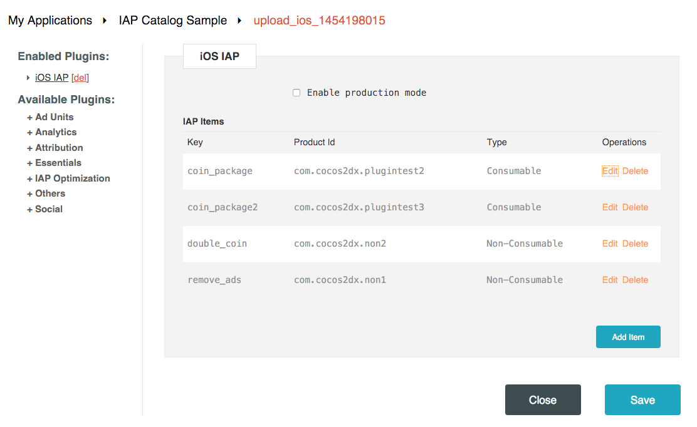

<h1>One-the-Fly Catalog Management</h1>

Both Apple's AppStore and Google's Play store allow mobile developers to create In-App purchase products through their web consoles. Typically these purchasable products will be created with names, types, and prices. SDKBOX LiveOps allows you to decide on-the-fly which of these products should be sold in your app. 

For example, let's say you have a product called "Chest of Coins" in the app which is selling for $3.99. For the coming holiday, you wan to promote it on sale for $0.99. We will use [SDKBOX In-App Purchase sample project](https://github.com/sdkbox/sdkbox-iap-sample) to show you how to do that without releasing a new build. 

## Setup
* Clone the [SDKBOX In-App Purchase sample project](https://github.com/sdkbox/sdkbox-iap-sample) 
* Compile and build. You can choose between C++, Lua or Javascript. We will use C++ in the following steps. 
* Notice in the xcode console, there are debug logs showing all the IAP products initialized when app starts. The one called `Chest of Coins` has a price tag $3.99. We will change it next. 

## Remote config
* Open AppDelegate.cpp, you can find the paragraph about `sdkbox::init("***", "***")`. Those enable the sample app to use a remote configuration. It's currently referenced to our samples. 
* Got to [sdkbox.com](http://sdkbox.com), create a application, and upload the `sdkbox_config.json` from this sample. Remember to publish the config Live. 
* Overwrite the token and secret in the AppDelegate.cpp the yours which were generated with the new application on sdkbox.com
* [Learn more about Remote Configuration Management](./remote-config)

## Test
* Now you are ready to test the catalog management
* Got to sdkbox.com -> My Applications -> App -> iOS config -> iOS IAP plugin. You should see the following products which were uploaded from the sample sdkbox_config.json:

* The item with key name `coin_package` is mapped to product with id `com.cocos2dx.plugintest2`, which is setup as price tier 4 ($3.99). 
* Click on Edit of this item, and change the product id to `com.cocos2dx.sale.1`. Now you should see this: 
.
* Save and publish the new config to the cloud. 
* Now, restart the test app. You should see the sale item is initialized in the log. Purchase "coin_package" will promote for only $0.99!
