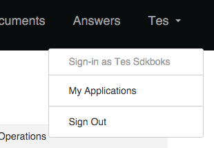
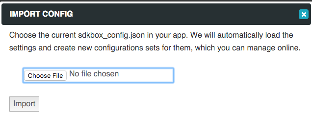
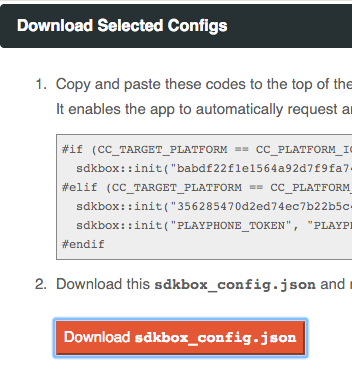

<h1>SDKBOX LiveOps</h1>

## Overview
__SDKBOX LiveOps__ enables developers to receive the benefits of cloud based functionalities, such as live-updating [Remote Configuration](./remote-config), server-side [IAP receipts verification](./receipt-verification), and on-the-fly [store catalog management](catalog-management). It helps to boost the mobile applications with extended features. 

!!! note
    SDKBOX LiveOps is an optional step for using SDKBOX to integrate mobile services. All SDKBOX plugins would work just fine locally on the device even when LiveOps is not used. 

## Setup LiveOps

1. Sign up and log onto [SDKBOX.com](http://sdkbox.com). 
2. Integrate service plugins with your app automatically with the [installer](/installer), or manually by downloading the [bundles](http://sdkbox.com/integrations).
3. Click on your login name -> select "My Application" -> create a `New application` for your app with name and bundle info.    

4. Upload the `sdkbox_config.json` from your app with "__Import__" function. One __configuration set__ will be created for each app store. 

5. Select "__Export__" and follow the instructions to link up your app client with the LiveOps services.  

!!! note
    The newly created configuration sets are still in __Draft__ state. They are not accessable by the client, until you can edit and publish them to the cloud. [Learn more about Remote Config](./remote-config). 

 

