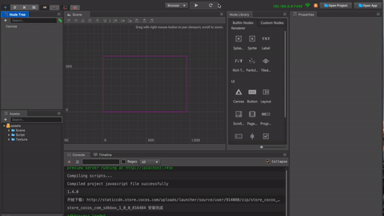

#SDKBOX for Cocos Creator

##Installation
Starting Cocos Creator 1.4 developer can install SDKBOX plugin from Extension Store

<iframe src='https://gfycat.com/ifr/ConsciousSomberGerenuk' frameborder='0' scrolling='no' width='640' height='360' allowfullscreen></iframe>

Once installed successfully, a new menu entry named "SDKBox" will be added to Cocos Creator 

##Integration
Before integrating SDKBOX plugins make sure you generate the iOS/Android build for your Cocos Creator projects first

<iframe src='https://gfycat.com/ifr/EntireLinearBeetle' frameborder='0' scrolling='no' width='640' height='360' allowfullscreen></iframe>

##After Intergration

How to use JS API in cocos creator

