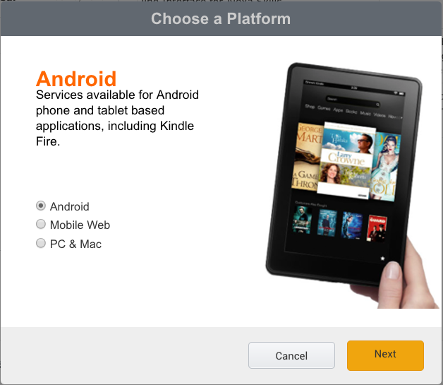
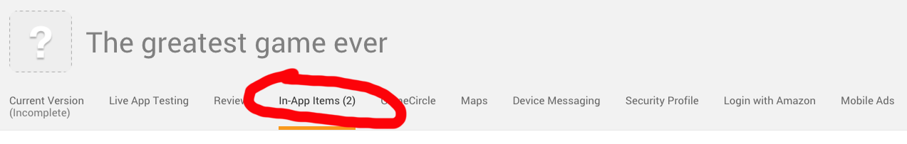
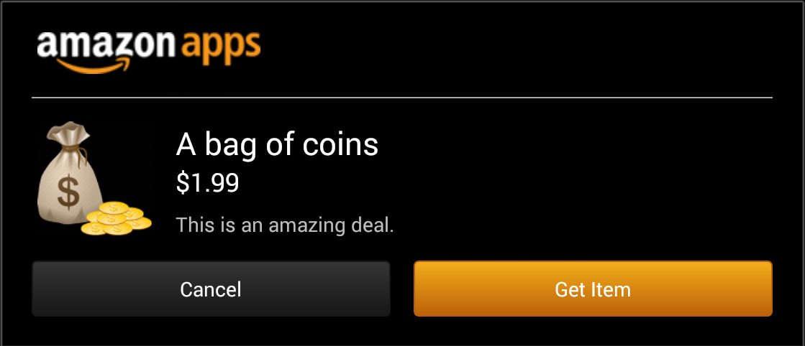

[&#171; SDKBOX Home](http://sdkbox.com)

<h1>How-to publish a Google Play game to Amazon App Store in 30 mins!</h1>>

If you have A Google Play Game using cocos2d-x and SDKBOX IAP plugin, you can earn more income by publishing it to Amazon's App Store with a very minimum effort. It's super easy and quick. This tutorial will show you how to do this in less than 30 mins.   

## Step 1: Integrate SDKBOX's Amazon plugin
Select the Amazon plugin in the SDKBOX Installer UI, or use the following commands to install the SDKBOX's Amazon plugin. Make sure you setup the SDKBOX installer correctly.


```bash
$ sdkbox import amazon
$ sdkbox set store amazon
```

## Step 2: Register an App on Amazon
Sign up a dev account at https://developer.amazon.com/home.html, and then `Add a New App`.




## Step3: Create IAP items on Amazon
It is very similar as Google Play IAP settings. Just create them one-by-one following Amazon's instruction. 




## Step4: Update App configuration
Add Amazon IAP items in the `sdkbox_config.json`. The sample config file in IAP plugin should have already included an `amazon` section in addition to `ios` and `android`. Make sure to use the `SKU` value in the `id` field:.

```json
{
    "ios":
    {
    },
    "android":
    {
    },
    "amazon" :
    {
        "iap":
        {
            "items":{
                "remove_ads":{
                    "id":"com.sdkbox.amazon.iaptest.1",
                    "type":"non_consumable"
                },
                "coin_package":{
                    "id":"com.sdkbox.amazon.iaptest.2"
                }
            }
        }
    }
}
```

## Step 5: Test the new Amazon App
The game is now ready to run on a local Kindle device: 

- Install [Amazon App Tester](http://www.amazon.com/Amazon-App-Tester/dp/B00BN3YZM2/) app
- Download a JSON Data File from Amazon and upload to the device:

    

```bash
    $ adb push [Your_JSON_File_Folder]/amazon.sdktester.json /mnt/sdcard/
```

- Install and run. Now the IAP items should be linked to Amazon App Store: 

    


## Step 6: Submit & Done!
Now finish the other App information and submit apk to Amazon App Store. 


## Question? We can help.
If you run into any problem, please try: 

- [Amazon Plugin API Docs](http://docs.sdkbox.com/en/plugins/amazon/)
- [SDKBOX Question & Answer](http://www.sdkbox.com/answers/)
- [Cocos2d-x/SDKBOX discussion forum](http://discuss.cocos2d-x.org/c/services)