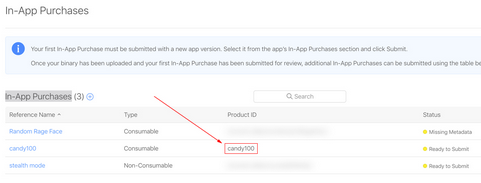

# IAP FAQ

## iOS In-App Purchase

> get Log `IAP :WARNING!, Products size is 0`

please check follow points:

* iTunes Connect -> Agreements, Tax, and Banking -> Master Agreements -> Paid Applications-> Contact Info / Bank Info / Tax Info (should be filled)

* check your product identifiers

```json
"ios" :
{
    "iap":{
        "items":{
            "remove_ads":{
                "id":"<this should be your productid>"
            }
        }
    }
}
```



* Xcode -> Capablities -> In-App Purchase , turn on

## iOS requestUpdateTransaction no callback

Invoke 
```
sdkbox::IAP::setListener(new your_iap_listener());
sdkbox::IAP::init();
``` 
as early as possible

## Android SDKBoxIABBillingClient: billingClient is null or not ready

maybe follow reason:

* Google Play not signin
* Google Play Service not installed

