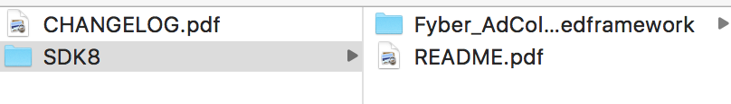
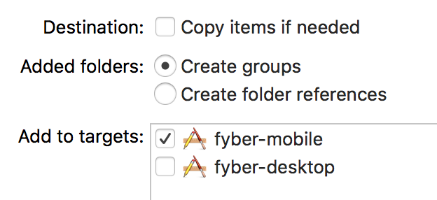
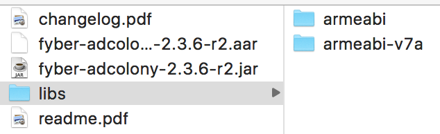
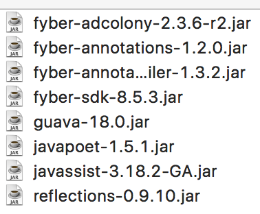
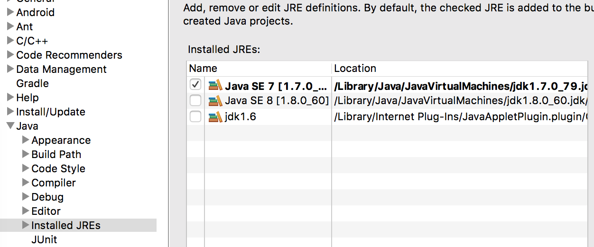
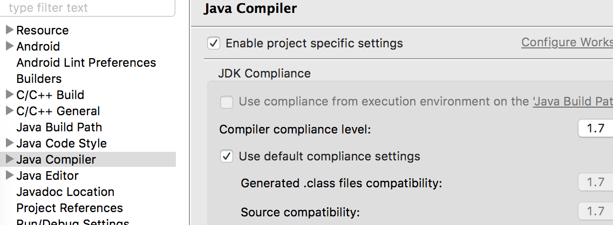
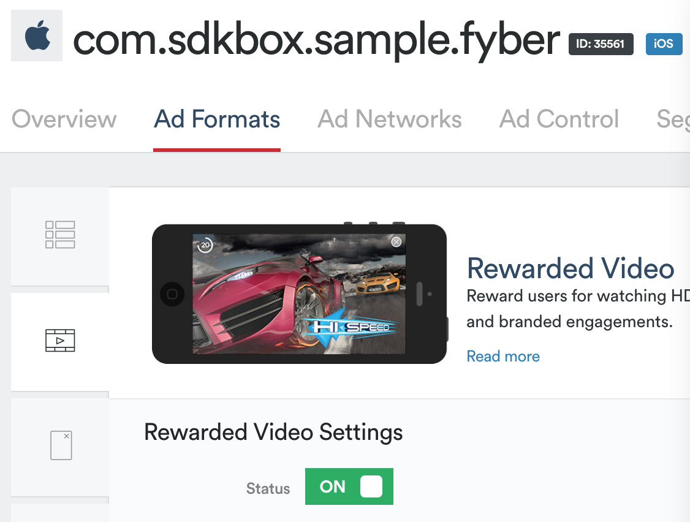
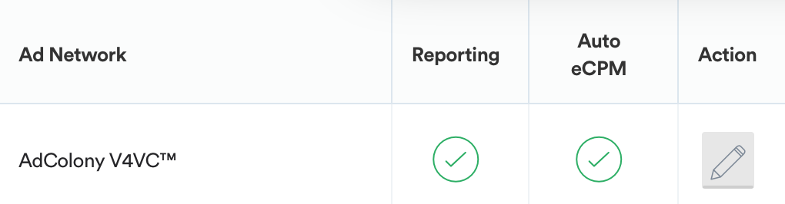

[&#171; SDKBOX Home](http://sdkbox.com)

<h1>Integration Fyber to cocos2d-x project</h1>>

### Environment

* `Coco2dx-x 3.10`
* `SDKBox Installer` 1.0.0.18 [Install](http://docs.sdkbox.com/en/installer/)

### Steps

#### create project

* create empty cocos2d-x project by run `cocos new -l cpp -p com.sdkbox.sample.fyber fyber`

#### import fyber

* import fyber by run `sdkbox import fyber -p /path/to/the/empty/cocos2d-x/project`

#### add mediation

##### ios

* download adcolony mediation at [here](http://developer.fyber.com/content/current/ios/rewarded-video/adding-networks/)
* unzip adcolony mediation `Fyber_AdColony_2.6.2-r1.zip`



* drag and drop `Fyber_AdColony_2.6.2-r1.embeddedframework` to xcode project



* open integration guide and follow it's steps


* read `README.pdf` in foler `Fyber_AdColony_2.6.2-r1`
* add required framework

#### android

* download android adcolony mediation at [here](http://developer.fyber.com/content/current/android/rewarded-video/adding-networks/)

* open integration guide and follow it's steps


* unzip adcolony mediation
* copy `fyber-adcolony-2.3.6-r2.jar` to `proj.android/libs`
* copy `libs/armeabi/libImmEndpointWarpJ.so` to `proj.android/libs/armeabi`
* copy `libs/armeabi-v7a/libImmEndpointWarpJ.so` to `proj.android/libs/armeabi-v7a`



* download [Fyber annotation jar](https://bintray.com/artifact/download/fyber/maven/com/fyber/fyber-annotations/1.2.0/fyber-annotations-1.2.0.jar) and add to `proj.android/libs`
* download [Fyber annotations processor jar](https://bintray.com/artifact/download/fyber/maven/com/fyber/fyber-annotations-compiler/1.3.2/fyber-annotations-compiler-1.3.2.jar) and add to `proj.android/libs`
* create folder `proj.android/annotation_libs`
* download [fyber-sdk](https://bintray.com/artifact/download/fyber/mobile-sdk/Fyber_Android_SDK_v8.5.3.zip), [fyber-annotation](https://bintray.com/artifact/download/fyber/maven/com/fyber/fyber-annotations/1.2.0/fyber-annotations-1.2.0.jar), [fyber-annotations-compiler](https://bintray.com/artifact/download/fyber/maven/com/fyber/fyber-annotations-compiler/1.3.2/fyber-annotations-compiler-1.3.2.jar), [guava](http://central.maven.org/maven2/com/google/guava/guava/18.0/guava-18.0.jar), [javapoet](http://central.maven.org/maven2/com/squareup/javapoet/1.5.1/javapoet-1.5.1.jar), [javassist](http://central.maven.org/maven2/org/javassist/javassist/3.18.2-GA/javassist-3.18.2-GA.jar), [reflections
](http://central.maven.org/maven2/org/reflections/reflections/0.9.10/reflections-0.9.10.jar) and add to folder `proj.android/annotation_libs`


* your `proj.android/annotation_libs` folder may include follow files




##### Eclipse Setting

Enable annotations in Eclipse

* Go to `project properties` -> `Java Compiler` -> `Annotation Processing` -> and check the `Enable project specific settings` checkbox
* Go to `project properties` -> `Java Compiler` -> `Annotation Processing` -> `Factory Path` -> and click on `Add JARs...` button and add all jars on `annotation_libs` folder


* Add `@FyberSDK` annotation to your main Activity and set up annotations on Eclipse.

* make sure `jdk 1.7` has been installed
* `Preference` -> `Java` -> `Installed JREs`


* `project properties` -> `Java Compiler` -> and make sure `compiler compliance level` is `1.7`


* add activity to manifest

```xml
<activity
    android:name="com.jirbo.adcolony.AdColonyOverlay"
    android:configChanges="keyboardHidden|orientation|screenSize"
    android:theme="@android:style/Theme.Translucent.NoTitleBar.Fullscreen" />
<activity
    android:name="com.jirbo.adcolony.AdColonyFullscreen"
    android:configChanges="keyboardHidden|orientation|screenSize"
    android:theme="@android:style/Theme.Black.NoTitleBar.Fullscreen" />
<activity
    android:name="com.jirbo.adcolony.AdColonyBrowser"
    android:configChanges="keyboardHidden|orientation|screenSize"
    android:theme="@android:style/Theme.Black.NoTitleBar.Fullscreen" />
```

##### website sitting

* entery Fyber [dashboard](https://dashboard.fyber.com/)
* enable reward, institial, banner



* add Adcolony network




#### Compile Run

* compile and run fyber on ios by run `cocos run -p ios -s /path/to/fyer/project`
* compile and run fyber on android by run `cocos run -p android -s /path/to/fyer/project`


#### Add more mediation

* other mediation integration steps is same with Adcolony
