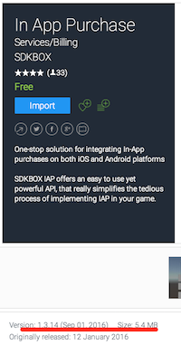
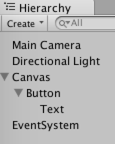
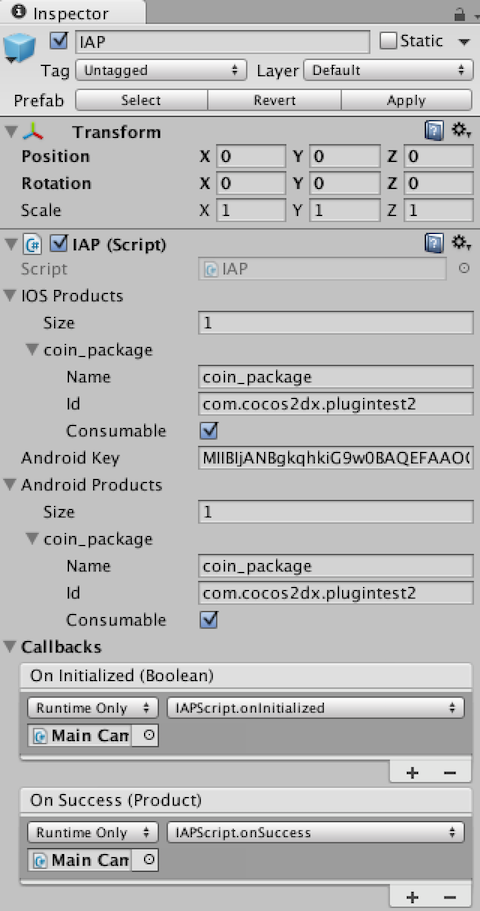
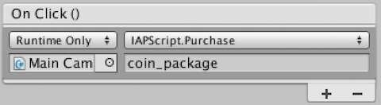
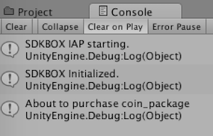
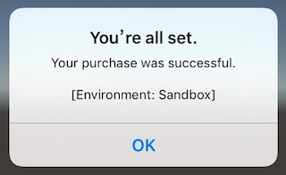
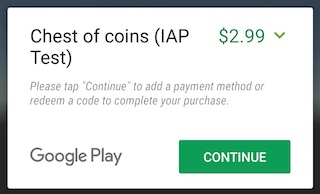
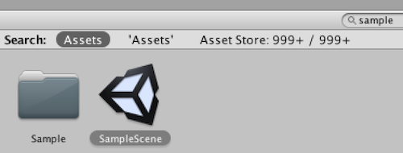

[&#171; SDKBOX Home](http://sdkbox.com)

<h1>IAP on Unity</h1>

## How to integrate IAP Plugin to Unity project
---

### Creator New Unity Project

* creator a new unity project, named it `SDKBoxTutorial`


### Import IAP Plugin

#### open assert store

* type `sdkbox iap` and search



* find sdkbox iap and import


### Integration

#### Create Button

create a `Buy` button, like follow:




#### add IAP prefab to scene

* search `IAP` prefab


* drag and drop `IAP` prefab into scene


#### Create `IAPScript` Script

* create a C# script, named it `IAPScript`:

```
using UnityEngine;
using System.Collections;

public class IAPScript : MonoBehaviour {

    private Sdkbox.IAP _iap;

    // Use this for initialization
    void Start () {
        _iap = FindObjectOfType<Sdkbox.IAP>();
        if (_iap == null) {
            Debug.Log("Failed to find IAP instance");
        }
    }

    // Update is called once per frame
    void Update () {
    }

    public void Purchase(string item) {
        if (_iap != null) {
            Debug.Log("About to purchase " + item);
            _iap.purchase(item);
        }
    }

    /*
     * Event Handlers
     */
    public void onInitialized(bool status) {
        Debug.Log("IAPScript.onInitialized " + status);
    }

    public void onSuccess(Sdkbox.Product product) {
        Debug.Log("IAPScript.onSuccess: " + product.name);
    }

    public void onFailure(Sdkbox.Product product, string message) {
        Debug.Log("IAPScript.onFailure " + message);
    }

    public void onCanceled(Sdkbox.Product product) {
        Debug.Log("IAPScript.onCanceled product: " + product.name);
    }

    public void onRestored(Sdkbox.Product product) {
        Debug.Log("IAPScript.onRestored: " + product.name);
    }

    public void onProductRequestSuccess(Sdkbox.Product[] products) {
        foreach (var p in products) {
            Debug.Log("Product: " + p.name + " price: " + p.price);
        }
    }
    public void onProductRequestFailure(string message) {
        Debug.Log("IAPScript.onProductRequestFailure: " + message);
    }
    public void onRestoreComplete(string message) {
        Debug.Log("IAPScript.onRestoreComplete: " + message);
    }

}
```

 *Note*: this script just handler iap event and purchase, you need handler `refresh` `getProducts`, see `PurchaseHandler` in `IAP Sample Scene`.

* attach `IAPScript` to Main Camera, (you can attach `IAPScript` to another node, it's ok)

#### Configure IAP

* select `IAP` prefab item
* checkout inspector view
* add your ios iap items to `ios products`

    - `Name` is used to identify the iap item ", used in the program.
    - `id` is `product id` of iap item in `itune connect`
    - if your iap item is consumable, check `Consumable`

* fill `Android Key` with your android key
* add your android iap items to `android products`

* fill callback with event handler function in `IAPScript`



#### Configure Buy Button

* connect `Buy` button's click listener to `Purchase` function of `IAPScript`



 *Note*: argment of `Purchase` is the name your iOS/Android product

#### Run Player

run player and click button, you will get follow log:



 *Note*: the operation of the purchase will not trigger on player, this just make sure script and other setting is fine.

#### Configure package name

open player setting, `Menu` -> `Edit` -> `Project Settings` -> `Player`, change ios/android `bundle identifier` to yours


#### Build iOS

* tap `Menu` -> `File` -> `Build Settings...`
* select `iOS` platform
* tap `Build` to generate ios project
* open `Unity-iPhone.xcodeproj`
* connect iOS device
* select your iOS development team
* build in xcode




#### Build Android

* tap `Menu` -> `File` -> `Build Settings...`
* select `Android` platform
* tap `Build` to generate android project
* open this project with eclipse
* build a release apk (must use release to test google iap)




## API Reference

SDKBox IAP For Unity, you can get all api from `IAP.cs`


### Methods

```
public void setDebug(bool debug)
public void getProducts() //will trigger listener event 'onProductRequestSuccess'
public void purchase(string name)
public void refresh()
public void restore()
```

### Callback

```
public void onInitialized(bool status)
public void onSuccess(Sdkbox.Product product)
public void onFailure(Sdkbox.Product product, string message)
public void onCanceled(Sdkbox.Product product)
public void onRestored(Sdkbox.Product product)
public void onProductRequestSuccess(Sdkbox.Product[] products)
public void onProductRequestFailure(string message)
public void onRestoreComplete(bool b, string message)
```

## IAP Sample

`SDKBox IAP` plugin include a sample scene, open it and try.


