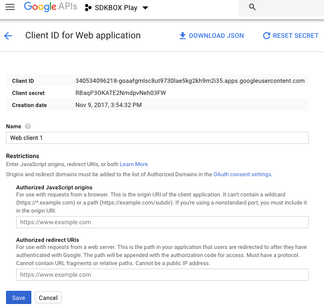

# SDKBoxPlay Troubleshoot

## Project Settings

1. Set `"cloud_save": false,` with `sdkbox_config.json` file.
2. Set Application ID: `<string name="google_app_id">1033290651465</string>` with `proj.android-studio/app/res/values/strings.xml` file.

## Keystore

please make sure keystore's SHA-1 is same in follow points:

- your keystore's SHA-1

run `keytool -list -v -keystore your.keystore` , will get follow:

```bash

...

Certificate fingerprints:
	 MD5:  09:F2:CA:99:6A:EF:8D:B7:17:B8:25:AE:36:40:9F:E2
	 SHA1: C7:4F:9C:6C:54:67:BC:81:27:25:40:EA:24:3D:B7:AA:1E:7A:7B:7D
	 SHA256: 92:51:09:9D:4A:A0:E5:4B:A8:6D:62:8B:3A:1B:F0:96:02:55:B9:1A:05:E4:68:32:0D:E1:F5:8A:A2:66:24:B1

...

```

- APK's SHA-1

download lastest apk from google play

get apk's SHA-1 by run:

```bash

unzip download.apk -d apk
keytool -printcert -file ./apk/META-INF/CERT.RSA

```

will get:

```

Certificate fingerprints:
	 MD5:  09:F2:CA:99:6A:EF:8D:B7:17:B8:25:AE:36:40:9F:E2
	 SHA1: C7:4F:9C:6C:54:67:BC:81:27:25:40:EA:24:3D:B7:AA:1E:7A:7B:7D
	 SHA256: 92:51:09:9D:4A:A0:E5:4B:A8:6D:62:8B:3A:1B:F0:96:02:55:B9:1A:05:E4:68:32:0D:E1:F5:8A:A2:66:24:B1

```

- Google Game services SHA-1

    * Goto [Google Play Console](https://play.google.com/apps/publish)
    * Tap 'Game services' -> app
    * Goto Google API Console

    

    

    * Check Android Client's SHA-1

    

    


__NOTE: the below three SHA-1 should be same.__


## Server Auth Code

if you need google sigin server auth code. you should fill `web_client_id` in sdkbox_config.json

```json
{
    "android": {
        "sdkboxplay": {
            ...
            "debug": true,
            "web_client_id": "340534096218-goaafgmlsc8ut9730lae5kg2kh9m2i35.apps.googleusercontent.com"
        }
    },
    "ios": {
        "sdkboxplay": {
            ...
        }
    }
}
```

and the `web_client_id` is come from:




if you needn't server auth code, please remove `web_client_id`.


