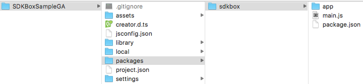
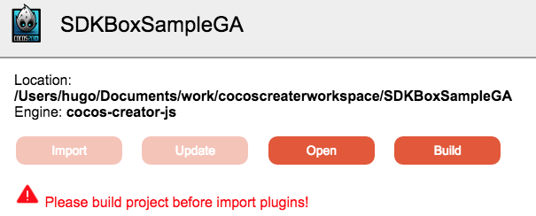
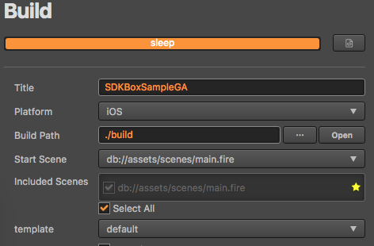
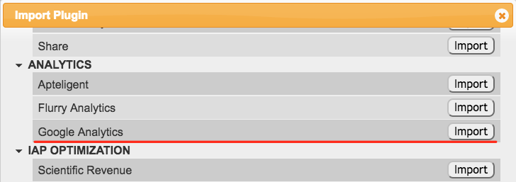

[&#171; SDKBOX Home](http://sdkbox.com)

<h1>SDKBOX GUI Plugin for Cocos Creator</h1>

## How to integrate SDKBox Plugin to Cocos Creator project with gui plugin
---

### Environment

Before you start, make sure you have both CocosCreator 1.3.3+

* `CocosCreator` [Install](http://www.cocos.com/creator)

### Download sdkbox gui creator plugin

download [SDKBox GUI](http://sdkbox.anysdk.com/gui/creator/sdkbox-1.4.1.zip) plugin file, here it's name is `sdkbox-1.4.1.zip`

### Create Project

create a empty creator project, named it `SDKBoxSampleGA`

### Install SDKBox GUI

install locall, available for one project

* extract `sdkbox-1.4.1.zip` to `SDKBoxSampleGA/packages/`, like follow:


install global, available for all project

* extract `sdkbox-1.4.1.zip` to `$HOME/.CocosCreator/packages/`(Mac) or `%USERPROFILE%\.CocosCreator\packages`(Win)

*NOTE*: if `SDKBox` menu not show, please reopen `CocosCreator`.

### Install SDKBox Plugin

Menu->SDKBox->Launch

if you have not build your project, sdkbox windows maybe like this:



build project first



*NOTE*: make sure `Start Scene` is not null

SDKBox will prompt a query dialog, you can install sdkbox plugin now or later.



SDKBox import `Google Analytics` (GA)


### Config SDKBox Plugin

edit `./build/jsb-default/res/sdkbox_config.json`

```json
{
    "android": {
        "GoogleAnalytics": {
            "trackingCode": "UA-62417901-1"
        }
    },
    "ios": {
        "GoogleAnalytics": {
            "track_init_screen": false,
            "trackingCode": "UA-62417901-1"
        }
    }
}
```

set `trackingCode` with your specific [__Google Analytics Tracking Code__](https://support.google.com/analytics/answer/1008080?hl=en) account information.

### Invoke SDKBox Plugin

create a new script named `GA.js` and attach to a node, here attach to Canvas

```javascript
cc.Class({
    extends: cc.Component,

    properties: {
    },

    onLoad: function () {
        if ('undefined' === typeof(sdkbox) || 'undefined' === typeof(sdkbox.PluginGoogleAnalytics)) {
            return;
        }
        sdkbox.PluginGoogleAnalytics.init();
        cc.log('GA init');
    },

    logEvent: function() {
        if ('undefined' === typeof(sdkbox) || 'undefined' === typeof(sdkbox.PluginGoogleAnalytics)) {
            return;
        }
        sdkbox.PluginGoogleAnalytics.logEvent("Test", "Click", "", 1);
        sdkbox.PluginGoogleAnalytics.dispatchHits();
        cc.log('GA log test');
    }
});
```

add a button to scene, and make click attach to `logEvent` function


### Build Project

Build Project (Shift + Command + B), this will sync new change to `jsb-default` project

### Compile & Run

open `./build/jsb-defalut` with Xcode, compile and run.
