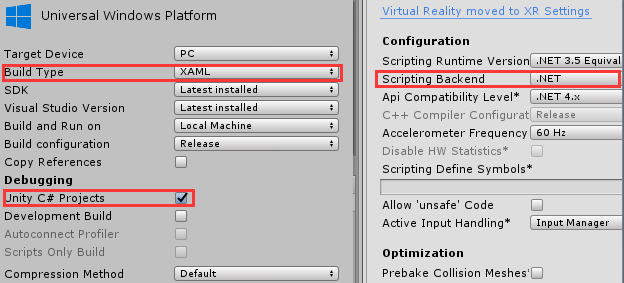
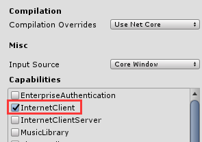
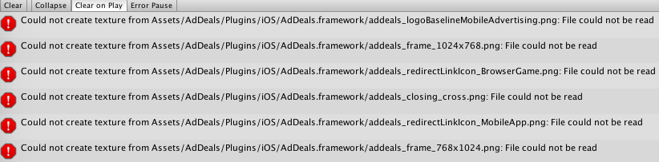

# Unity plugin for AdDeals

This is a cross-platform Unity plugin for [AdDeals](https://www.addealsnetwork.com/)'s SDKs. It combines and supports three platforms together: Windows(UWP), iOS, and Android.

System requirements:

* Unity v5.5.4.p5 or later
* Vistual Studio 2017 or later
* Xcode 10
* Android Studio 3.2.1


## Integrate

* In order to get your AppID  & AppKey you must first create an account on http://www.addealsnetwork.com
* Then add your iOS / Android / Windows 10 apps and you will get 1 AppID / AppKey for each app version. 
* <font color=#FF0000>Download</font> the AdDeals plugin from either Unity's marketplace(Coming soon), or [sdkbox github repo](https://github.com/sdkbox/AdDeals-Unity-Plugin/raw/master/AdDeals-0.0.5.unitypackage). 
* Drag `Assets\AdDeals\AdDeals.prefab` onto your game scene.
* Call AdDeals SDK APIs. Please check out the sample codes in `Assets\AdDeals\Sample\Test.cs`: 
```
AdDeals.AdDealsWrapper.Init("AppID", "AppKey");

int adType = 1; // 1:interstitial 2: reward
AdDeals.AdDealsWrapper.ShowAd(adType);
```


### Windows UWP build

* Support the lastest AdDeals SDK for Windows:  [AdDealsUniversalSDKW81](https://www.nuget.org/packages/AdDealsUniversalSDKW81).
* Using .Net ScriptBackend, please export the UWP <font color=#FF0000>project (project)</font> in Unity with the following settings: 

    

* Please enable `InternetClient` setting for UWP under `PlayerSetting`->`Universal Windows Platform`->`Publishing Setting`->`Capabilities`

    

* For Unity 5.x: because Vistual Studio 2017 is required for UWP application to target aginest the lastest UWP SDK, please make sure to install the [Unity Patch Releases](https://unity3d.com/unity/qa/patch-releases) with UWP support.


### iOS build

* From Unity, first export to an iOS project. Next build and run it using xCode. 
* Support iOS 8+. 


### Android build

* From Unity, first export the application to a Gradle project. Next build and run it using Android Studio. __Do NOT build APK directly in Unity.__

       

* Support Android SDK v15+.
* For Unity 5.x: please edit `YOUR_EXPORTS_PROTECT_ROOT/build.gradle` with the following configurations:
```gradle
    ...
    android {
        ...
        defaultConfig {
            minSdkVersion 15
            targetSdkVersion 28
            versionCode 1
            versionName '0.1'
            ...
        }
        ...
    }
    ...
```


## API

### Methods


```
void AdDeals.AdDealsWrapper.Init(String appID, String appKey);
```
* Initialize the AdDeals SDK.

```
void AdDeals.AdDealsWrapper.SetConsent(int consent);
```
* Set privacy policy consent.

```
void AdDeals.AdDealsWrapper.IsAvailable(int adType, int uiOrientation);
```
* Check availability.
* `uiOrientation` is invalid on UWP. Set to `AdDealsWrapper.UIOrientationUnknown`. 

```
void AdDeals.AdDealsWrapper.CacheAd(int adType, string placementID, int uiOrientation);
```
* Cache Ad.
* `placementID` in most cases just leave it "".
* `uiOrientation` is invalid on UWP, set to `AdDealsWrapper.UIOrientationUnknown`. 

```
void AdDeals.AdDealsWrapper.ShowAd(int adType, string placementID, int uiOrientation);
```
* Show Ad. 
* `placementID` in most cases just leave it "".
* `uiOrientation` is invalid on UWP, set to `AdDealsWrapper.UIOrientationUnknown`.


__Note__: placementID is an advanced feature and in most cases you can just leave it “”. In case you want to use placementIDs you should contact addeals@ahead-solutions.com

### Constants

#### UI Orientation
```
AdDealsWrapper.UIOrientationUnknown = 0;
AdDealsWrapper.UIOrientationPortrait = 1;
AdDealsWrapper.UIOrientationPortraitUpsideDown = 2;
AdDealsWrapper.UIOrientationLandscapeRight = 3;
AdDealsWrapper.UIOrientationLandscapeLeft = 4;
```

#### Ad type
```
AdDealsWrapper.AdTypeInterstitial = 1;
AdDealsWrapper.AdTypeRewardVideo = 2;
```


## Verification

Tested on the follow Unity versions:

* Unity v2018.2.16f
* Unity v2018.1.0f2
* Unity v2017.1.2f1
* Unity v2017.1.0p5
* Unity v5.5.4p5


## Sample Project

[https://github.com/sdkbox/AdDeals-Unity-Sample](https://github.com/sdkbox/AdDeals-Unity-Sample)


## Issues

* if you got follow error when import this unitypackage, it's ok, you can ignore it.




