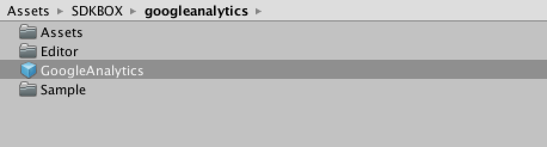
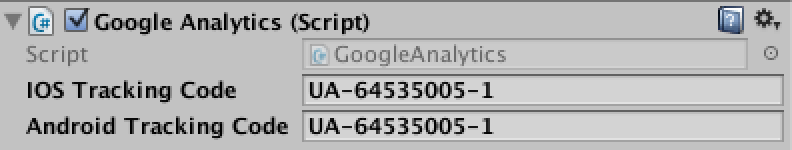

<h1>Google Analytics Documentation.</h1>

For more information, visit our website @ [www.sdkbox.com](http://cocos2d-x.org/sdkbox)

<h2>Importing SDKBOX GoogleAnalytics</h2>

First import the ```sdkbox_googleanalytics``` unity package into your project. This will create a directory SDKBOX under Assets. If you have other SDKBOX plugins installed, they will appear here too. A plugins directory may also be present if you have other SDKBOX plugins. This directory contains files for iOS and Android.

<h2>Using the GoogleAnalytics Plugin</h2>

To begin using GoogleAnalytics plugin, find the GoogleAnalytics prefab in the Assets/SDKBOX/googleanalytics directory. 



Drag an instance of this prefab into the scene where you want to start using analytics. You should only have a single instance of this prefab at any time.


Select the GoogleAnalytics game object in the hierarchy and in your inspector pane you can configure the object to complete the setup.

<h2>Configuring the GoogleAnalytics Plugin</h2>



<h3>Description of Fields</h3>

<h5>iOS Tracking Code</h5>
This is the tracking code from your Google Analytics account. You can use the same code for both platforms if you like, or you can have different codes for each. It's up to you.

<h5>Android Tracking Code</h5>
This is the tracking code from your Google Analytics account. You can use the same code for both platforms if you like, or you can have different codes for each. It's up to you.

<h2>GoogleAnalytics API</h2>

<h6>
The analytics session is being explicitly started at plugin initialization time.
</h6>
```
public static void startSession();
```

<h6>
You normally will never stop a session manually. But if you need to, you can call this manually.
</h6>
```
static void stopSession();
```

<h6>
Manually request dispatch of hits. By default, data is dispatched from the Google Analytics SDK for Android every 5 minutes.
</h6>
```
static void dispatchHits();
```

<h6>
Change the dispatch info time period to the desired amount of seconds.
</h6>
```
static void dispatchPeriodically(int seconds);
```

<h6>
Stop periodically sending info. Then manually the <code>dispatchPeridically</code>
or <code>dispatchHits</code> should be called.
</h6>
```
static void stopPeriodicalDispatch();
```

<h6>
Set user ID for this tracking session.
</h6>
```
static void setUser(string userID);
```

<h6>
Set value for custom dimension.
</h6>
```
static void setDimension(int index, string value);
```

<h6>
Set value for custom metric.
</h6>
```
static void setMetric(int index, string value);
```

<h6>
Log screen info. title is the title of a screen. Screens are logical units
inside your app you'd like to identify at analytics panel.
</h6>
```
static void logScreen(string title);
```

<h6>
logEvent("Achievement", "Unlocked", "Slay 10 dragons", 5);
</h6>
```
static void logEvent(string eventCategory, string eventAction, string eventLabel, int value);
```

<h6>
Log an exception. It is a basic support for in-app events.
</h6>
```
static void logException(string exceptionDescription, bool isFatal);
```

<h6>
Measure a time inside the application.
</h6>
```
static void logTiming(string timingCategory, int timingInterval, string timingName, string timingLabel);
```

<h6>
Log a social event.
</h6>
```
static void logSocial(string socialNetwork, string socialAction, string socialTarget);
```

<h6>
While running on dry run, the tracked events won't be sent to the actual
analytics account.
</h6>
```
static void setDryRun(bool enable);
```

<h6>
Enable advertising tracking when in google's ad vendors.
</h6>
```
static void enableAdvertisingTracking(bool enable);
```

<h6>
Create a tracker identified by the google analytics tracker id XX-YYYYYYYY-Z.
If the tracker already existed, no new tracker will be created. In any case, the tracker associated with tracker id will be set as default tracker for  analytics operations.
</h6>
```
static void createTracker(string trackerId);
```

<h6>
 * Enable a tracker identified by a trackerId. If the tracker does not exist,
 * nothing will happen.
</h6>
```
static void enableTracker(string trackerId);
```

