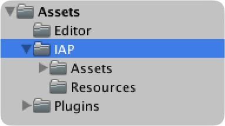
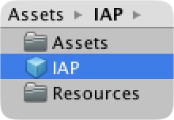
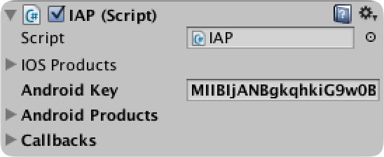
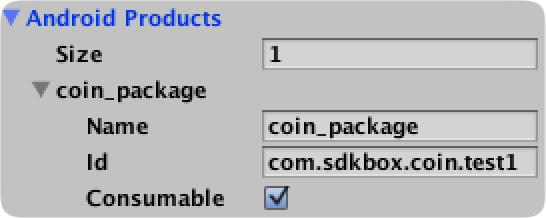
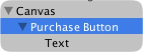
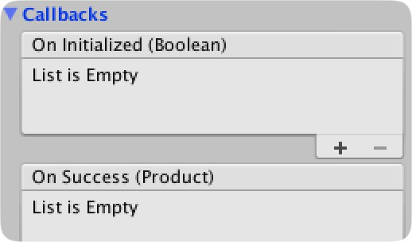

<h1>In App Purchase Documentation.</h1>

For more information, visit our website @ [www.sdkbox.com](http://cocos2d-x.org/sdkbox)

<h2>Setting up your Unity project for In App Purchase</h2>

This guide does not cover creating the project itself, or creating apps in the iOS or Google app stores. For instructions on how to do that, please visit the iOS and Android documentation. 

How each store recognizes your app is different for iOS and Android. On iOS, you need the bundle identifier to retrieve products from the store. You can get this bundle identifier from the Apple developer member center where you created your app. This bundle identifier must be specified in the iOS section of Player Settings. You can find more information [here](https://developer.apple.com/library/ios/documentation/LanguagesUtilities/Conceptual/iTunesConnectInAppPurchase_Guide/Chapters/Introduction.html#//apple_ref/doc/uid/TP40013727)

On Android, there is a key that you must specify in the IAP configuration inspector pane. You can get this key from the Google Play Console where you setup your app and create in app purchase products. You can find more information [here](http://developer.android.com/google/play/billing/billing_overview.html)

<h2>Importing SDKBOX IAP</h2>

To begin using SDKBOX IAP, import the ```sdkbox_iap``` unity package into your project. This will add a directory under Assets called IAP. 



This directory contains everything you will need in order to make In-App-Purchases.


To begin, find the IAP prefab in the IAP directory. 



Create an instance of the IAP prefab in the scene where you want to make in app purchases, such as your store scene.

Select the IAP game object in the hierarchy and in your inspector pane you can configure the object for In-App-Purchases.

<h2>Specifying a key (Android)</h2>



On Android, need a license key from the ```Services & APIs``` section of the Google Play Developer Console. Copy and paste this key into the Android Key field.

<h2>Adding Products</h2>

Products are added on either iTunes connect for Apple, or Google Play Portal for Google. Follow directions <insert links> on how to setup products for Apple and Google platforms.

Each product will have a name, and there are two types of products. Consumable and Non-consumable. Google only supports the latter, but SDKBOX allows you to have Consumable products on Google as well as Apple, and they behave the same way.

In the ```Products``` field for each platform, you can specify how many products you have, and you can enter the name of each product, and whether or not it is consumable. 



<h2>Making Purchases</h2>

Making a purchase is as simple as invoking the ```purchase``` method on the IAP game object. There are several ways to do this, we will do it by adding a button.

From the menu, choose **Game Object** -> **UI** -> **Button**. This will create a UI canvas (if you didn't have one already) and add a button. 



Name your button in the hierarchy what you like, and change the text to "Purchase" or something similar.

Now in the inspector pane, find the ```On Click()``` event and from the object drop down, select the IAP game object. Then from the method drop down, select the ```IAP.purchase``` method.

This method takes a string argument that is the name of the product being purchased. You can enter that name under the method name in the space provided.


<h2>Handling Callbacks</h2>

There are several events that provide feedback about what is happening when you initialize, make purchases, or restore previously purchased items.

The following is a list of the callbacks and the parameters they provide.

* ```onInitialized (bool status)``` Called after the IAP system initializes. It will pass a boolean value that indicates whether or not the initialization was successful or not. A value of ```true``` indicates success. 

* ```onProductRequestSuccess (Product[] products)``` Called after initialization, and having requested the products from the store using the keys specified for each platform. If the request was successful, then this callback is invoked and passed the array of available products.

* ```onProductRequestFailure (string error)``` Called after initialization, and if a product request fails. The string will contain an error message.

* ```onSuccess (Product product)``` Called after a successful purchase. The product is supplied as an argument. See ```Product``` for more details.

* ```onFailure (Product product, string error)``` Called after a failed purchase attempt. The product is supplied as an argument, and a string is passed containing an error message.

* ```onCanceled (Product product)``` Called if a In-App-Purchase is canceled. The product is supplied as an argument.

* ```onRestored (Product product)``` Called for each product restored from the store. If no products have been purchased, then you will only get the following completed call.

* ```onRestoreComplete ()``` Called after all products have been restored. If none were restored, you will still receive this callback.

<h2>Handling IAP Events</h2>

Similar to the button On Click() event, you can subscribe to SDKBOX IAP events to get feedback about the IAP process, and to receive products from the IAP store.

In the ```Callbacks``` section of the IAP script inspector pane, you can click ```+``` to add a subscriber, and specify the object, and method that you would like to have invoked.



<h2>Product Class</h2>

```
	public struct Product
	{
		public enum Type {CONSUMABLE, NON_CONSUMABLE};

		// The name specified in sdkbox_config.json
		public string name;
		
		// The product id of an In App Purchase
		public string id;
		
		// Type of iap item
		public Type type;
		
		// The title of the IAP item
		public string title;
		
		// The description of the IAP item
		public string description;
		
		// Price value in float
		public float priceValue;
		
		// Localized price
		public string price;
		
		// price currency code
		public string currencyCode;
	}
```

The product class contains all the information about a product retrieved from the server, as well as the consumable state set in the editor.

You should not create your own products, but rather allow SDKBOX IAP to create them for you.

<h2>Additional Android Instructions</h2>

<h3>Override Unity Activity</h3>

In order for In-App-Purchase to work, we have to be able to forward certain activity methods to the billing code. To do this on Unity we have to replace the Unity main activity. If you do not have your own custom activity, and also have not provided your own AndroidManifest.xml, then the package will automatically copy the activity and manifest to the correct location. If there is already a manifest present, then it will notify you with a dialog to read this section and perform the following steps.

1. Copy the file *CustomActivity.jar* from **Assets/SDKBOX/Assets/Resources** to **Assets/Plugins/Android**
2. Modify your AndroidManifest.xml:
   2.1 Locate this line: 
```
        <action android:name="android.intent.action.MAIN" /> 
```
   2.2 Change the value of "activity android:name" of the parent node to 
   "com.sdkbox.activity.CustomActivity" 


<h3>Adding Vendor Billing Permission</h3>

In order for In-App-Purchase to work on Android, it needs the following permission to be added.

```
<uses-permission android:name="com.android.vending.BILLING" />
```

If you have not specified your own AndroidManifest.xml then when you import the package, one will be copied that already has this permission set.

If you do have your own already, then you will need to add this permission to it.

The AndroidManifest.xml is merged with the main manifest that Unity creates when building the APK.
