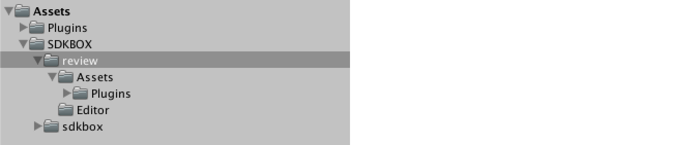
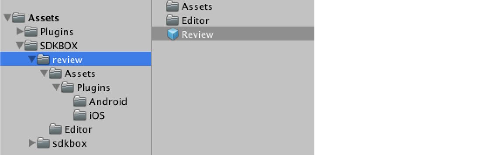
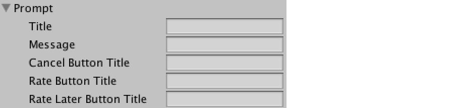
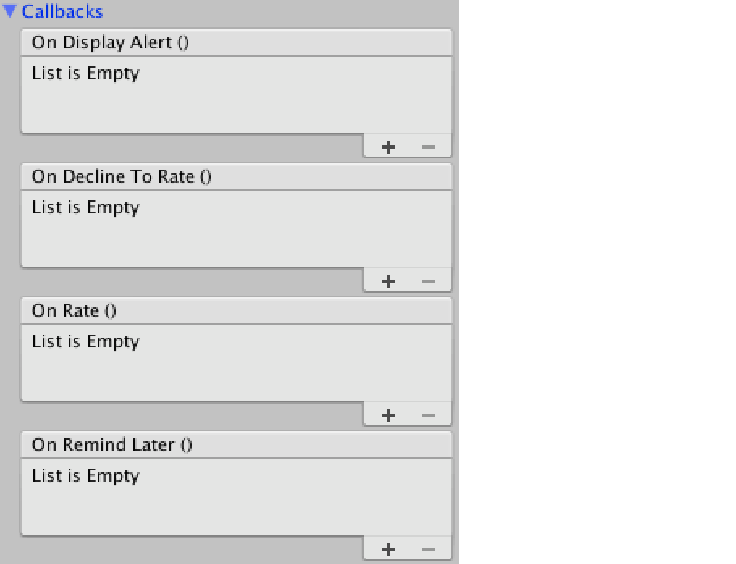

<h1>Review Documentation.</h1>

For more information, visit our website @ [www.sdkbox.com](http://cocos2d-x.org/sdkbox)

**<h2>Important. Users of SDKBOX IAP pre-v1.3.7</h2>**

If you have used and installed SDKBOX IAP v1.3.6 or earlier, you must either update to IAP 1.3.7 or delete the Assets/IAP directory, before adding other SDKBOX plugins.

<h2>Importing SDKBOX Review</h2>

First import the ```sdkbox_review``` unity package into your project. This will create two directories in Assets, one for review and one for sdkbox. If you have other SDKBOX plugins installed, they will appear here too. A plugins directory will also be present if you have other SDKBOX plugins. This directory contains files for iOS and Android.



To begin using Review, find the Review prefab in the Assets/SDKBOX/review directory. 



Create an instance of the Review prefab in the scene where you want to use the Review package. You should only have a single instance of this prefab at any time.

Select the Review game object in the hierarchy and in your inspector pane you can configure the object to customize the Review dialog.

<h2>Configuring the Review Plugin</h2>


<h3>Description of Fields</h3>

IOS App Id

<h5>Day Limit</h5>
This specifies the number of days the app needs to wait before prompting the user to rate the app.

<h5>Launch Limit</h5>

This specifies the number of launches to wait before prompting the user to rate the app.

<h5>User Event Limit</h5>

Specifies the number of user events to wait for until prompting the user. You can tell the Review plugin when user events happen by calling ```Review.UserDidSignificantEvent```

<h5>Day For Reminding</h5>

Specifies the number of days to wait before reminding again, once the user has pressed the 'remind me later' option.

<h5>Launch For Reminding</h5>

Specifies the number of launches to wait before reminding again, once the user has pressed the 'remind me later' option.

<h5>Try Prompt When Init</h5>

If true, will attempt to show the rate dialog when the plugin initializes, i.e. right when the app starts.

<h2>Configuring the Review Dialog</h2>



You can configure all of the text on the Review dialog, either to customize, or to localize the text. 

<h2>Handling Review Events</h2>

In the ```Callbacks``` section of the Review script inspector pane, you can click ```+``` to add a subscriber, and specify the object, and method that you would like to have invoked.



<h2>Review API</h2>

```
void show(bool force);

void userDidSignificantEvent(bool canPromptForRating);

void setTitle(string title);

void setMessage(string message);

void setCancelButtonTitle(string cancelTitle);

void setRateButtonTitle(string rateTitle);

void setRateLaterButtonTitle(string rateLaterTitle);
```

<h2>Additional iOS Instructions</h2>
On some older versions of Unity, the static libraries in Review/Assets/Plugins/iOS do not get included in the XCode project. In this case they need to be moved to Assets/Plugins/iOS or added to the XCode project manually.
