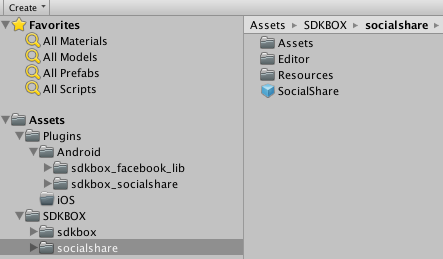
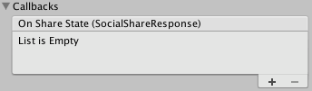
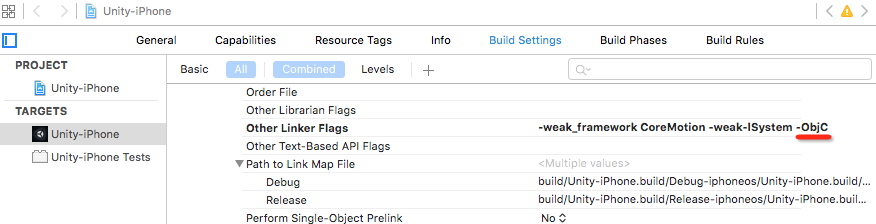
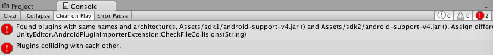

<h1>SocialShare Documentation.</h1>

For more information, visit our website @ [www.sdkbox.com](http://cocos2d-x.org/sdkbox)

<h2>Importing SDKBOX SocialShare</h2>

First import the ```sdkbox_socialshare``` unity package into your project. This will create two directories(PLugins and SDKBOX) in Assets.


To begin using SocialShare, find the SocialShare prefab in the Assets/SDKBOX/socialshare directory.



Create an instance of the SocialShare prefab in the scene where you want to use the SocialShare package. You should only have a single instance of this prefab at any time.

Select the SocialShare game object in the hierarchy and in your inspector pane you can configure the object to customize the SocialShare dialog.

<h2>Configuring the Review Plugin</h2>


<h3>Description of Fields</h3>

Config

<h5>Twitter Key IOS</h5>
This specifies twitter key of ios platform, if none, will not show in share panel on ios.

<h5>Twitter Secret IOS</h5>

This specifies twitter secret of ios platfoorm, if none, will not show in share panel on ios.

<h5>Twitter Key Android</h5>

This specifies twitter key of android platform, if none, will not show in share panel on android.

<h5>Twiiter Secret Android</h5>

This specifies twitter secret of android platform, if none, will not show in share panel on android.

<h5>facebook enable</h5>

This specifies if facebook show in share panel.

<h5>Social Panel Title</h5>

This specifies social panel custom title

<h5>Social Panel Cancel</h5>

This specifies social panel custom cancel button

<h2>Handling SockalShare Events</h2>

In the ```Callbacks``` section of the SocialShare script inspector pane, you can click ```+``` to add a subscriber, and specify the object, and method that you would like to have invoked.



<h2>SocialShare API</h2>

```
void setSharePanelTitle(string s)
void setSharePanelCancel(string s)
void share(SocialShareInfo info)

```

<h2>Manual Setp</h2>

<h5>IOS Platform</h5>

- when build ios, you need insert fllow code to info.plist, and replace `280194012150923 ` with your facebook app id


```
<key>FacebookAppID</key>
<string>280194012150923</string>
<key>FacebookDisplayName</key>
<string>helloworld - Test1</string>
<key>CFBundleURLTypes</key>
<array>
    <dict>
        <key>CFBundleTypeRole</key>
        <string>Editor</string>
        <key>CFBundleURLSchemes</key>
        <array>
            <string>fb280194012150923</string>
        </array>
    </dict>
</array>
<key>LSApplicationQueriesSchemes</key>
<array>
    <string>fbapi</string>
    <string>fb-messenger-api</string>
    <string>fbauth2</string>
    <string>fbshareextension</string>
</array>
```

- if you use < unity 5.0, you need add '-ObjC' to `other linker flag` in ios project build setting



<h5>Android Platform</h5>

when build android, you need the fllow two modify

- replace string `280194012150923` with your facebook app id in file `Assets/Plugins/Android/sdkbox_facebook_lib/AndroidManifest.xml`

```
<provider android:authorities="com.facebook.app.FacebookContentProvider280194012150923"
            android:name="com.facebook.FacebookContentProvider"
            android:exported="true" />
```

- replace `facebook_app_id`'s value with your facebook app id in file `Assets/Plugins/Android/sdkbox_facebook_lib/res/values/string.xml`

```
<resources>
    <string name="facebook_app_id">280194012150923</string>
    ....
</resources>
```

<h2>Additional iOS Instructions</h2>
On some older versions of Unity, the static libraries in Review/Assets/Plugins/iOS do not get included in the XCode project. In this case they need to be moved to Assets/Plugins/iOS or added to the XCode project manually.

<h2>Trouble Shoot</h2>



if your unity project contains multiple `android-support-v4.jar` files, when you compile android, will get error.
In this case, under normal circumstances, you can delete the `android-support-v4.jar` file, leaving only one
