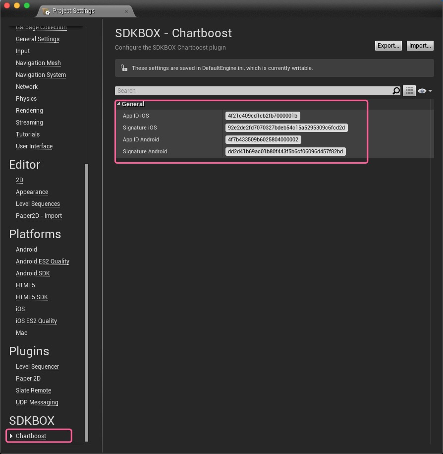
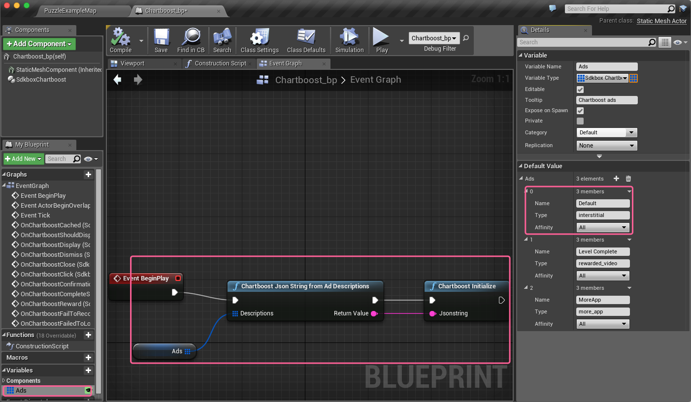
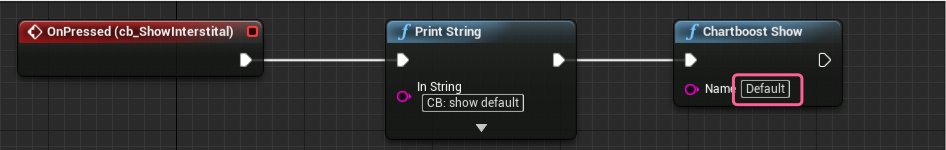
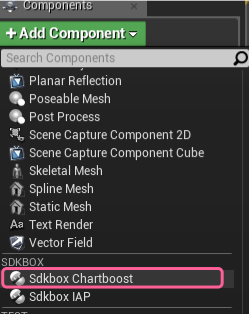

<h1>Chartboost Documentation.</h1>

For more information, visit our website @ [www.sdkbox.com](http://cocos2d-x.org/sdkbox)

<h2>Setting up your Unreal Engine 4 project for Chartboost</h2>

Before you start, make sure you have the following items

* A Chartboost account, sign up [here](https://www.chartboost.com)
* [An app in your dashboard](https://answers.chartboost.com/hc/en-us/articles/200797729-Your-First-App-and-Campaign-)

<h2>Installing the SDKBOX Chartboost Plugin for UE4</h2>

Download the SDKBOX Chartboost Plugin from the SDKBOX UE4 website [here](http://www.sdkbox.com/unreal)

<h3>In Your Engine</h3>

1. Unpack the files into ```Engine/Plugins/SDKBOX/```
2. Run the GenerateProjectFiles script in the Engine root.
3. Open your engine project file and build the editor.

<h3>In Your Code Project</h3>

1. Unpack the files in your ```[Project Root]/Plugins/SDKBOX``` directory.
2. Relaunch the editor. This will prompt you to build the plugin for the editor, go ahead and accept to build the plugin and continue launching the editor.

<h2>Enable the Plugin</h2>

Goto Settings -> Plugins and scroll down to Project if you have added the plugin to your code project, otherwise it will be part of Built-In.


Make sure the the Enabled checkbox is checked. You may have to restart the editor after this step.

<h2>Initialize the Plugin</h2>

It is important to call the SDKBOX Chartboost initialization method early, or at least before you call any other methods. You can do this by calling it from your Game Instance Init event, or your first scene's Begin Play event.

The init method takes a JSON string as a parameter. You can pass a raw string if you would like, but you can also add the Ad descriptions in the Blueprint editor and build the string at runtime.



To add products in the Blueprint editor, first add a variable ```Ads``` of type ```Chartboost Json String From Ad Descriptions``` and make it an Array.

Now you can add Ads in the editor by clicking on Products and adding items to the Default Value in the Details pane.



You can now create a function to convert the Ads variable into a JSON string that you can feed into the initialize function (pictured above).


<h2>Show Chartboost Ad</h2>




<h2>Handling Events</h2>

You can handle events from the plugin by adding the Sdkbox Chartboost component to an actor in your scene.




```
    // Called after an interstitial has been loaded from the Chartboost API servers and cached locally.
    void onChartboostCached(const std::string& name);

    // Called before an interstitial will be displayed on the screen.
    bool onChartboostShouldDisplay(const std::string& name);

    // Called after an interstitial has been loaded from the Chartboost API servers and cached locally.
    void onChartboostDisplay(const std::string& name);

    // Called after an interstitial has been dismissed.
    void onChartboostDismiss(const std::string& name);

    // Called after an interstitial has been closed.
    void onChartboostClose(const std::string& name);

    // Called after an interstitial has been clicked.
    void onChartboostClick(const std::string& name);

    // Called after a rewarded video has been viewed completely and user is eligible for reward.
    void onChartboostReward(const std::string& name, int reward);

    // Called after an interstitial has attempted to load from the Chartboost API servers but failed.
    void onChartboostFailedToLoad(const std::string& name, sdkbox::CB_LoadError e);

    // Called after a click is registered
    void onChartboostFailToRecordClick(const std::string& name, sdkbox::CB_ClickError e);

    // Called if Chartboost SDK pauses click actions awaiting confirmation from the user.
    void onChartboostConfirmation();

    // Called after the App Store sheet is dismissed, when displaying the embedded app sheet.
    void onChartboostCompleteStore();
```

More information:
- https://answers.chartboost.com/hc/en-us/articles/201220275
