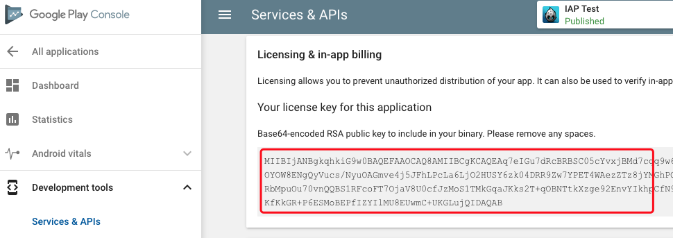

[&#8249; IAP Doc Home](./)

<h1>In-App Purchase Integration Guide</h1>
<<[../../shared/-VERSION-/version.md]

##Integration
Open a terminal and use the following command to install the SDKBOX IAP plugin. Make sure you setup the SDKBOX installer correctly.
```bash
$ sdkbox import iap
```

**NOTE**:
1. For iOS, you need Xcode9 because of https://developer.apple.com/app-store/promoting-in-app-purchases/

2. For iOS, [Auto-Renewables subscription, in sandbox the validity time differs from live environment!!!](https://dev-ios.blogspot.com/2011/05/validity-time-auto-renewables-in.html)

    | Durations | Sandbox Duration | Incentive Durations (optional) |
    | --------- | ---------------- | ------------------------------ |
    | 7 days    | 3 minutes        | 7 days                         |
    | 1 month   | 5 minutes        | 7 days, 1 month                |
    | 2 months  | 10 minutes       | 7 days, 1 month                |
    | 3 months  | 15 minutes       | 1 month                        |
    | 6 months  | 30 minutes       | 1 month, 2 months              |
    | 1 year    | 1 hour           | 1 month, 2 months, 3 months    |

    After 6 extensions the abo is cancelled automatically in the sandbox environment.

<<[../../shared/notice.md]

## Configuration
SDKBOX Installer will automatically inject a sample configuration to your `sdkbox_config.json`, that you have to modify it before you can use it for your own app.

Here is an example of the IAP configuration, you need to replace `<put the product id for ios here>` with the product id from your [iTunes Connect](http://itunesconnect.apple.com) or  replace `<put your googleplay key here>` from your [Google Play Console](https://play.google.com/apps/publish).

> For GooglePlay, you must specify the public key in the IAP configuration inspector panel. You can get it from the section "Services & APIs" of Google Play Console.


```json
"ios" :
{
    "iap":{
        "items":{
            "remove_ads":{
                "id":"<put the product id for ios here>"
            }
        }
    }
},
"android":
{
    "iap":{
        "key":"<put your googleplay key here>",
        "items":{
          "remove_ads":{
              "id":"<put the product id for android here>"
          }
        }
    }
}
```

If you have IAP items,  whose type is __non-consumable__ or __subscription__, it is also necessary to supply the type for each item in your `sdkbox_config.json`. Only __Android__ requires this step. Taking the same *json* above your config might now look like this example:
```json
"android":
{
    "iap":{
        "key":"<put your googleplay key here>",
        "items":{
            "coins":{ //this is consumable item
                "id":"<put the product id for android here>"
            },
            "remove_ads":{
                "id":"<put the product id for android here>",
                "type":"non_consumable" //this is non-consumable item
            },
            "subscription":{
                "id":"<put the product id for android here>",
                "type":"subs" //this is subscription item
            }
        }
    }
}
```

__Note__: the `key` in sdkbox_config.json should be get from `Google Play Console`, take a look at follow screenshot:




<!--<<[sdkbox-config-encrypt.md]-->

##Usage
<<[usage.md]

<<[../../shared/remote_application_config.md]

<<[../shared/receipts_verification.md]

<<[promoting_iap.md]

<<[api-reference.md]

<<[manual_integration.md]

<<[manual_ios.md]

<<[../../shared/manual_integration_android_and_android_studio.md]

<<[manual_android.md]

<<[extra-step.md]

<<[../../shared/manual_integration_google_play_step.md]

<<[proguard.md]


