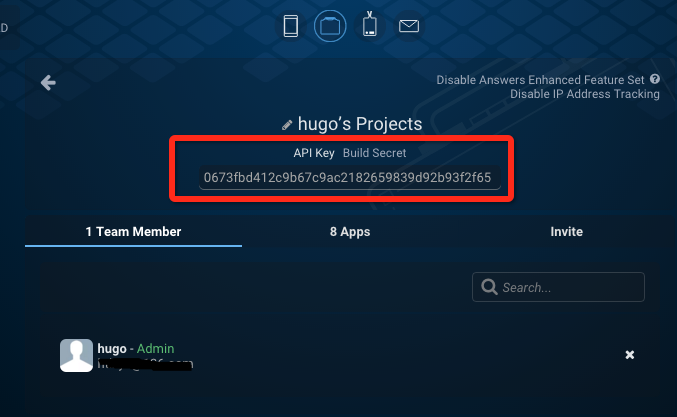

[&#8249; Share Doc Home](./)

<h1>Share Integration Guide</h1>
<<[../../shared/-VERSION-/version.md]

##Overview
SDKBOX Share plugin provide an one stop solution for developers to share to all social platforms.

Currently SDKBOX Share supports share via **twitter**, **facebook** and **SMS**

Please make sure you create developer account on the following platforms

* [Facebook](http://developers.facebook.com/)
* [Twitter](http://apps.twitter.com/) (For twitter you'll also need [Fabric](https://fabric.io))

##Integration
Open a terminal and use the following command to install the SDKBOX Share plugin. Make sure you setup the SDKBOX installer correctly.
```bash
$ sdkbox import share
```

You will also need to import SDKBOX facebook plugin if you want enable facebook share support
```bash
$ sdkbox import facebook
```
Facebook plugin have some extra integration steps, please click [here](http://docs.sdkbox.com/en/plugins/facebook/v3-cpp/#extra-steps)

<<[../../shared/notice.md]

<!--## Configuration
<<[../../shared/sdkbox_cloud.md]
<<[../../shared/remote_application_config.md]-->

### JSON Configuration
SDKBOX Installer will automatically inject a sample configuration to your `res/sdkbox_config.json`, that you have to modify it before you can use it for your own app

Here is an example of the Share configuration
```json
    "android": {
        "Facebook": {
            "debug": false
        },
        "Share": {
            "platforms": {
                "Twitter": {
                    "params": {
                        "secret": "nlmUdPNcFGLWhyLu9cD794EDuDrVQnjd0YjTpB6sX8oHIQRrne",
                        "key": "EuovpLL0UhSGB7Jv5eKFJNMqO"
                    }
                },
                "Facebook": {},     //support facebook share
                "SMS": {},          //support sms share
                "EMail": {}         //support email share
            }
        }
    },
    "ios": {
        "Facebook": {
            "debug": true
        },
        "Share": {
            "platforms": {
                "Twitter": {
                    "params": {
                        "secret": "haVcKarM96Sr4390XLQoHjyRUSyuHdkMX6letcc38h8TOWyiR9",
                        "key": "BUJTV6NEM7BAhhm82B12VbKGy"
                    }
                },
                "Facebook": {},     //support facebook share
                "SMS": {},          //support sms share
                "EMail": {}         //support email share
            }
        }
    }
```

**Twitte configuration**

you need to replace `<key>`, `<secret>` item with your specific [Twitter](http://apps.twitter.com/) account.

For android only

you also need replace `<api_key>` with your [fabric organization](https://fabric.io/settings/organizations) item in `AndroidManifest.xml`
``` xml
<meta-data
            android:name="io.fabric.ApiKey"
            android:value="api_key" />
```

You can get fabric organization apikey in the organization screen


**Facebook configuration**

you need to add a `Facebook` entry in the config


<!--<<[sdkbox-config-encrypt.md]-->

##Usage
<<[usage.md]

<<[api-reference.md]

<<[manual_integration.md]

<<[manual_ios.md]

<<[../../shared/manual_integration_android_and_android_studio.md]

<<[manual_android.md]

<<[extra-step.md]

<<[proguard.md]

##Notice

email share can't test on simulator
